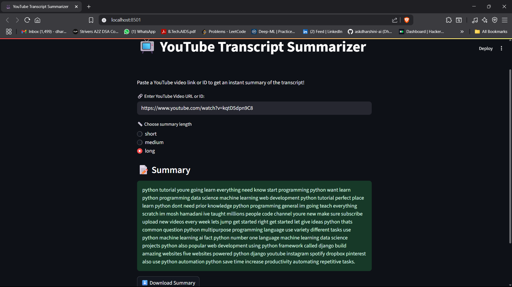

# 🚀 Who Am I?
I’m Dharshini, a builder at heart and a B.Tech graduate in Artificial Intelligence & Data Science who doesn’t just learn tech — I live and breathe it.

- 🔍 I dig deep into problems, turning messy data into meaningful insights

- 🛠️ I craft AI-powered solutions from scratch — from APIs to user-friendly UIs

- 💬 I make machines understand language through NLP, OCR, and LLMs

- 🔗 I connect the dots — from backend logic to frontend flow, from Python scripts to cloud-hosted apps

## I'm not just preparing for the future of AI — I'm building it one repo at a time. 🔥

### 🧠 Fun Fact
I believe AI isn't just about automation – it's about **augmentation**.  
I love building things that help humans make **smarter, faster, and kinder** decisions.

---

### 📬 Looking for Opportunities Let's connect!

- 💼 [LinkedIn](https://www.linkedin.com/in/askdharshiniai/)  
- 📬 Email: dharshini.k5003@gmail.com  
- 🌐 [Portfolio](https://dharshini-portfolio.netlify.app/)

---

# 🚀 Project Title: YouTube Transcript Summarizer

## 📌 Problem Statement
In the age of information overload, YouTube videos often contain valuable insights buried within long transcripts. However, users rarely have time to watch full videos or read lengthy transcripts. This project solves that by automatically extracting and summarizing the transcript of any YouTube video—giving users a concise version in seconds.

## 🎯 Objectives
- Fetch transcripts of any public YouTube video using its URL or ID.
- Clean the raw text to remove noise and irrelevant tokens.
- Summarize the transcript into a short, readable version (short, medium, or long).
- Provide an interactive UI for users to input links and get summaries instantly.
- Save and allow downloading of results.

## 🧠 Tech Stack / Tools Used
- Python 🐍
- Libraries: 
      nltk for text preprocessing and summarization
      pandas for data handling
      streamlit for UI
      youtube-transcript-api for fetching transcripts
- VS Code
- Streamlit

## 📂 Project Structure
```
📁 data/
    📁 raw/
    📁 processed/
📁 outputs/
    📁 graphs/
    📄 results.csv
📁 src/
    📄 data_loader.py
    📄 model.py
    📄 utils.py
📁 app/
    📄 app.py
📄 README.md
```

## 📈 Results & Screenshots


## 🗒️ Learnings
- How to use youtube-transcript-api effectively for public videos
- NLTK's scoring-based extractive summarization
- Streamlit for quick UI deployment
- Error handling for unavailable videos/transcripts
- Managing text preprocessing to enhance summarization
## 📦 How to Run
```bash
# Step 1: Clone the repo
git clone https://github.com/careerbytecode/ai-ml-3-month-internship.git

# Step 2: Navigate to this project folder
cd Project02-YouTube-Transcript-Summarizer

# Step 3: Create virtual environment & activate
python -m venv venv
source venv/bin/activate  # For Windows: venv\Scripts\activate

# Step 4: Install dependencies
pip install -r requirements.txt

# Step 5: Run your script or notebook
python -m streamlit run app/app.py
```

🧑‍💻 _Project done as part of CareerByteCode's AI/ML Internship Program_ 🔥
