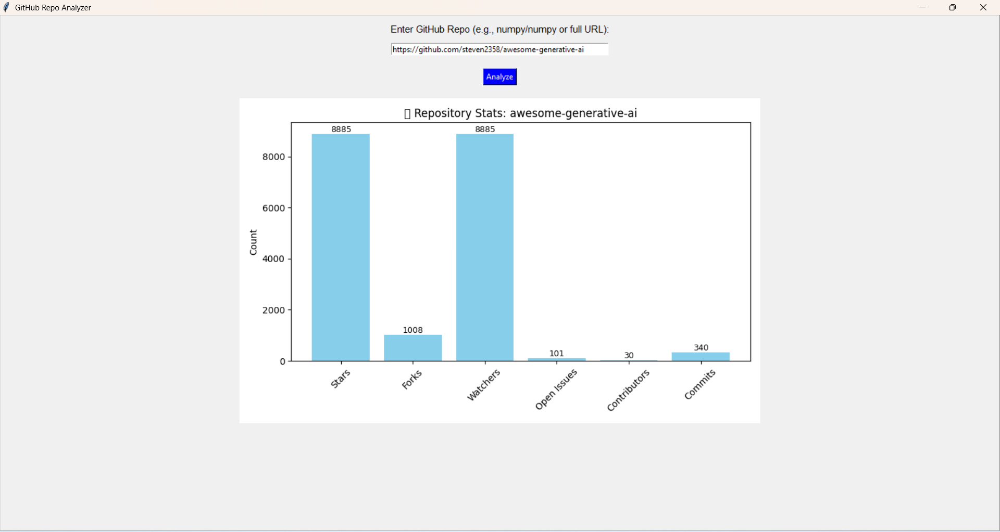

# 🚀 Project Title: GitHub Repository Analyzer GUI (Using Tkinter & GitHub API)

## 📌 Problem Statement
Manually tracking and analyzing GitHub repository statistics such as stars, forks, watchers, and contributors can be tedious and error-prone. Developers, researchers, and tech enthusiasts often need a quick visual summary of a repository’s popularity and development activity without browsing GitHub repeatedly.

## 🎯 Objectives
- Create a user-friendly desktop GUI application to fetch and visualize GitHub repository statistics.
- Provide real-time insights into key metrics like stars, forks, watchers, issues, contributors, and commits.
- Display results in an intuitive bar chart using matplotlib.
- Handle invalid inputs and API failures gracefully.

## 🧠 Tech Stack / Tools Used

- **GUI Framework** :	Tkinter
- **API Interaction	Request** :(GitHub REST API)
- **Visualization**	:Matplotlib
- **Language**:	Python 3.x
- **Version Control**:	Git, GitHub
- **OS Compatibility**	:Windows, Linux, macOS

## 📂 Project Structure
<pre>```
github-repo-analyzer/
│
├── data/                             # Stores project-related documentation or raw inputs
│   └── data_note(github).pdf         # Instructions on using GitHub repository URLs
│
├── outputs/                                 # Output visualizations or models
│   ├── graphs/Barchart                      # Bar charts and other matplotlib visualizations
│   └── working_model/ Step_1 and Step_2     # Any processed or saved models/results
│
├── src/                              # Source logic for API and plotting
│   ├── main.py                       # CLI-based analyzer entry point
│   ├── visualizer.py                 # Code for visualizing repository stats
│   └── github_api.py                 # GitHub API interaction logic
│
├── app/                              # GUI interface for desktop use
│   └── tk_ui.py                      # Tkinter-based app window for input and visualization
│
├── README.md                         # Project overview and instructions
└── requirements.txt                  # Python dependencies
```</pre>

## 📈 Results & Screenshots



## 🗒️ Learnings
- Learned how to interact with GitHub's public REST API using Python.
- Understood how to build responsive desktop GUI applications using Tkinter.
- Practiced modular Python programming by splitting logic into different functional files.
- Learned to handle edge cases and API rate limits with error handling.
- Enhanced skills in data visualization with Matplotlib.
- Applied real-world use of API integration + GUI development.

## 📦 How to Run
```bash
# Step 1: Clone the repo
git clone https://github.com/careerbytecode/ai-ml-3-month-internship.git

# Step 2: Navigate to this project folder
cd ProjectXX-Your-Project-Title

# Step 3: Create virtual environment & activate
python -m venv venv
source venv/bin/activate  # For Windows: venv\Scripts\activate

# Step 4: Install dependencies
pip install -r requirements.txt

# Step 5: Run your script or notebook
python src/model.py
```

## 📬 Submission Checklist
- [x] Code is committed & pushed to GitHub
- [x] `README.md` is updated
- [x] Output screenshots/graphs are in the `outputs/` folder
- [x] Notebook contains explanations or comments

---
🧑‍💻 _Project done as part of CareerByteCode's AI/ML Internship Program_ 🔥
